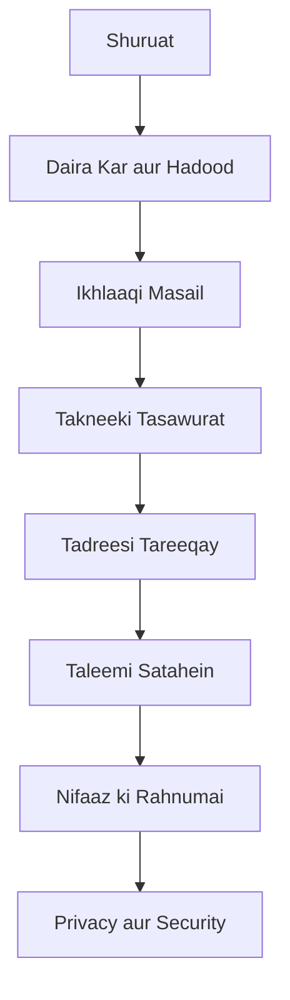

# Physical AI aur Humanoid Robotics - Taleem mein Khush Aamdeed

Ye kitab **Physical AI aur Humanoid Robotics** ko taleemi mahol mein lagane ke bare mein hai.

## Is Kitab ke bare mein

Ye kitab aapko ye sikhayegi:

- **Bunyadi Tasawurat**: Physical AI aur Humanoid Robots kya hain
- **Ikhlaaqi Masail**: Robot technology ko taleem mein istemal karte waqt ikhlaaqi khayalat
- **Tadreesi Tareeqay**: Robots ko classroom mein kaisay istimal karen
- **Nifaaz ki Rahnumai**: Apne school ya institution mein robotics program kaise shuru karen
- **Privacy aur Security**: Talaba ki data aur mehfooziyat ka khayal

## Ye Kitab Kis ke liye hai?

- **Muallimeen** (Teachers) - Jo robots ko apni class mein lana chahte hain
- **School Administrators** - Jo robotics programs shuru karna chahte hain
- **Curriculum Designers** - Jo robotics-based syllabus banana chahte hain
- **Researchers** - Jo taleemi robotics par research kar rahe hain
- **Students** - Jo is field mein seekhna chahte hain

## Kitab ki Tafreet

## Shuruat Kaise Karen

1. **[Daira Kar aur Hadood](./01-scope-boundaries.md)** - Samjhen ke ye kitab kya cover karti hai
2. **[Ikhlaaqi Masail](./02-ethical-dilemmas.md)** - Ikhlaaqi challenges ko jaanen
3. **[Takneeki Tasawurat](./03-technical-concepts.md)** - Bunyadi technology samjhen
4. **[Tadreesi Tareeqay](./04-pedagogical-approaches.md)** - Sikhane ke tariqe seekhen
5. **[Nifaaz ki Rahnumai](./06-implementation-guidance.md)** - Practical implementation guide

## Mazeed Madad

- **Sawalat?** - [GitHub Issues](https://github.com/Awais68/physical-AI-Homanoid-Book/issues) par poochen
- **Contribution?** - Pull requests ka shukriya!
- **Updates?** - Star karen repository ko updates ke liye

---

**Aaiye shuru karte hain!** 🚀

Pehle chapter [Daira Kar aur Hadood](./01-scope-boundaries.md) se shuruat karen.
