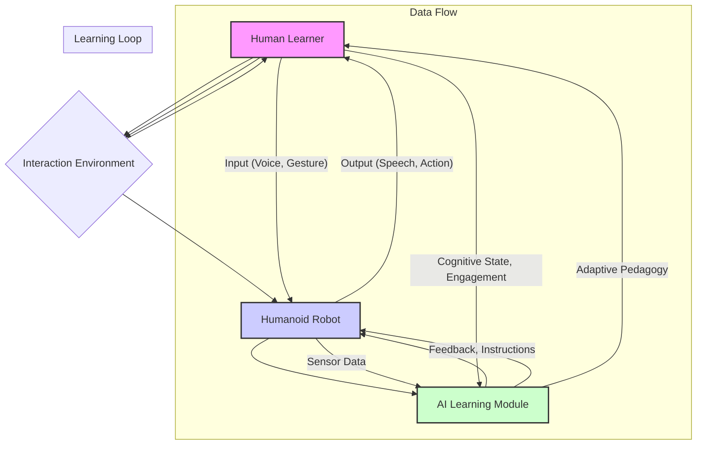

# Data Model for Physical AI & Humanoid Robotics in Education

This document outlines conceptual models or frameworks relevant to the learning resource book on Physical AI & Humanoid Robotics in Education. Unlike a software data model, this focuses on abstract structures for understanding complex interactions and relationships.

## Conceptual Models (if applicable)

*(This section will be populated if specific conceptual models or frameworks emerge during the research and writing phases that require formal documentation. Examples might include models for human-robot interaction in learning, frameworks for ethical decision-making in educational AI, or cognitive models of embodied learning.)*

## Example Conceptual Model (Placeholder: Human-Robot Learning Interaction Model)

**Description of the Human-Robot Learning Interaction Model:**

This model illustrates the dynamic interplay between a human learner, a humanoid robot, and its integrated AI learning module within an educational context. It highlights:

-   **Human Learner**: Provides input (e.g., voice commands, gestures) and receives output (e.g., robot speech, actions). Their cognitive state and engagement influence the AI.
-   **Humanoid Robot**: Acts as the physical interface, receiving commands and sensor data, and performing actions. It's the mediator in the interaction environment.
-   **AI Learning Module**: Processes sensor data, provides adaptive feedback and instructions to the robot, and is influenced by the learner's cognitive state.
-   **Interaction Environment**: The shared space where human and robot interact.
-   **Data Flow**: Represents the communication channels, including human input, sensor data, and robot outputs.
-   **Learning Loop**: Depicts how the AI adapts its pedagogical approach based on the learner's state, aiming to optimize learning outcomes.

*(This model is a conceptual example. The actual content of `data-model.md` will depend on the specific conceptual frameworks developed or adopted during the project.)*
